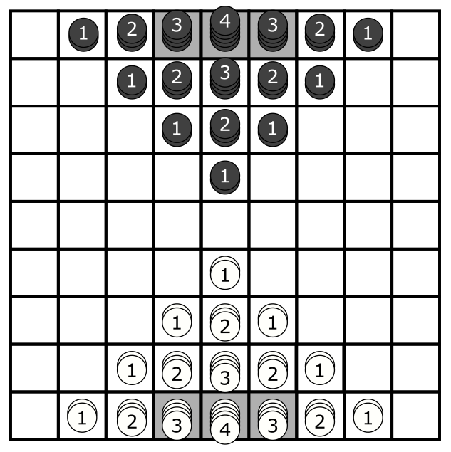

# High road
* Abstract strategy
* 2 players
* 15-20 minutes
## Introduction
In **High Road** two players compete to be the first to connect the two opposite edges of the board with stacks of pieces owned by them.
## Components
* 1 game board
* 60 stackable pieces (30 white, 30 black)
## Setup
Place the game board in between the players. Each player chooses a color to play with. Black moves first. Set the stackable pieces according to the figure below, where the numbers indicate the number of tokens in each stack.

## How to play
## End of the game
